# Mildew Detection in Cherry Leaves

- Live App Link: [Here.](https://powdery-mildew-detection-mkm-c29095774113.herokuapp.com)

## Dataset Overview  
The dataset is sourced from [Kaggle](https://www.kaggle.com/datasets/codeinstitute/cherry-leaves). We developed a hypothetical user story where predictive analytics can be applied to a real-world project in the workplace.  
The dataset consists of over 4,000 images captured from the clients cherry crop fields. The images depict both healthy cherry leaves and those affected by powdery mildew, a fungal disease impacting many plant species. The cherry plantation is one of the company's premium products, and there is significant concern about maintaining high product quality in the market.

## Business Case Assessment

### Business Requirements
- **Requirement 1**: Visually distinguish between healthy and mildew-affected cherry leaves.
- **Requirement 2**: Predict whether a cherry leaf is healthy or contains mildew using an ML model.

### Can Conventional Data Analysis Address These Requirements?
- Requirement 1: Yes, conventional data analysis can help in visually distinguishing the leaves.
- Requirement 2: No, ML is necessary for prediction tasks.

### Does the Client Need a Dashboard or an API Endpoint?
- The client requires a dashboard.

### Success Criteria
- A tool to differentiate healthy and mildew-affected leaves.
- A prediction system with at least 97% accuracy integrated into the dashboard.

### User Stories

#### User Story: Information Gathering and Data Collection
- As a data scientist, I want to collect and prepare the dataset to train an accurate model.

#### User Story: Data Visualization and Cleaning
- As a data analyst, I want to visualize and clean the data to ensure high-quality input for the model.

#### User Story: Model Training and Optimization
- As a machine learning engineer, I want to train a binary classifier to predict leaf health.

#### User Story: Dashboard Development
- As a user, I want to upload leaf images to the dashboard and receive instant predictions.

#### User Story: Deployment and Release
- As a project manager, I want to deploy the dashboard so the client can access it.

## Privacy and Ethical Considerations
- Data under NDA should only be shared with authorized personnel.
- Ensure data handling adheres to privacy agreements.

## ML Business Case

### What are the business requirements?  
The client seeks a tool to accurately differentiate between healthy cherry leaves and those affected by mildew. Given that ML can effectively classify images, this need aligns well with ML capabilities.

### Can Conventional Data Analysis Address Any of the Business Requirements?  
Requirement 1 can be addressed through traditional data analysis methods. However, Requirement 2 cannot be solved using conventional approaches, making ML necessary to tackle this challenge.

### Does the Client Need a Dashboard or an API Endpoint?  
The client requires a dashboard.

### What Constitutes a Successful Project Outcome for the Client?  
The client should be able to visually differentiate between healthy and mildew-affected leaves and predict if a leaf is healthy or infected by mildew via an interactive dashboard.

### What Are the Model's Inputs and Intended Outputs?  
The input is a cherry leaf image, and the output is a prediction indicating whether the leaf is healthy or contains mildew.

### Does the Data Suggest a Particular Model?  
The data points towards a binary classification model.

### What Are the Criteria for the Performance Goal of Predictions?  
The client has agreed upon an accuracy goal of 97%, though the model has been trained to achieve 99%.

### How Will the Client Benefit?  
By reducing manual inspection time, the client will be able to supply the market with higher-quality, mildew-free products. The ability to scale operations across farms will further enhance productivity and efficiency.

## Dashboard Design  
- A project summary page outlining the dataset and the clients requirements.
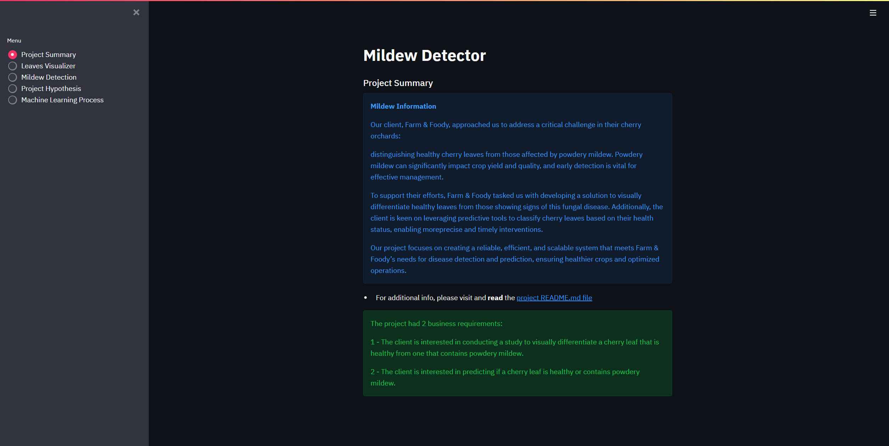
- A page summarizing the findings from the study on visually differentiating between healthy and mildew-affected cherry leaves.
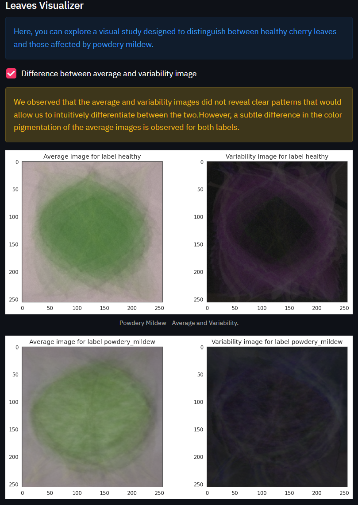
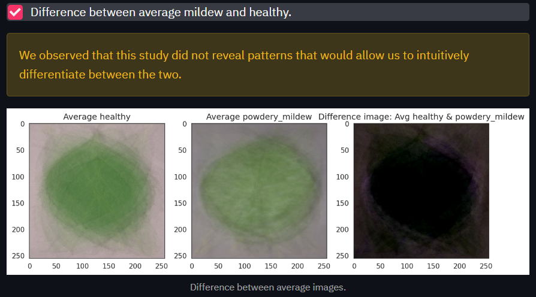
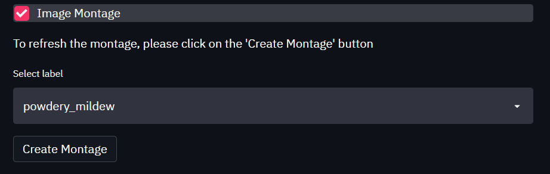
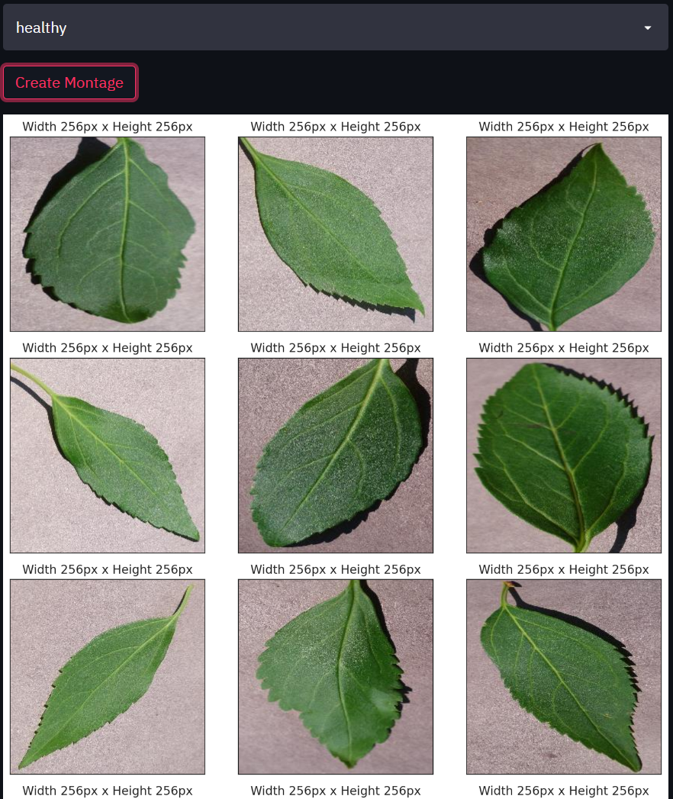
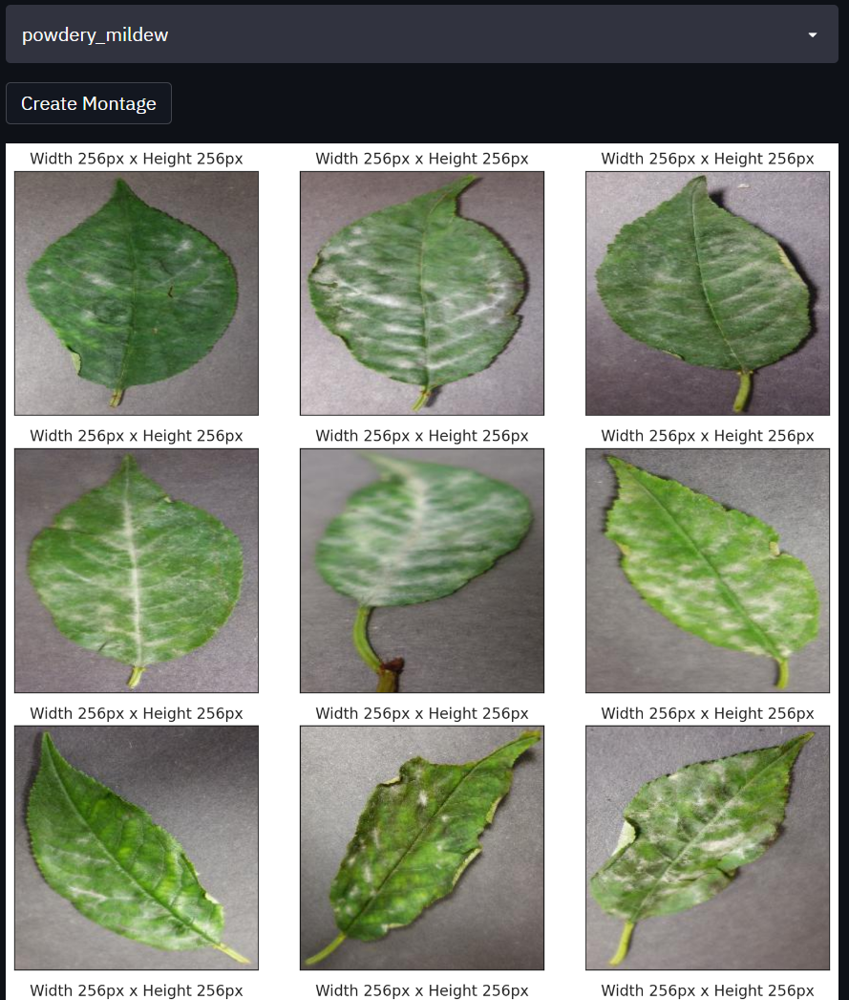
- A page with a link to download a set of cherry leaf images for live prediction (Kaggle repository). An interactive User Interface featuring a file uploader widget, where users can upload multiple images. Each image will display along with a prediction statement indicating whether the cherry leaf is healthy or infected with mildew, along with associated probabilities. A table summarizing the image names and prediction results, along with a download button to obtain this data.
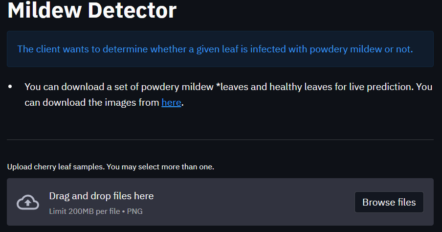
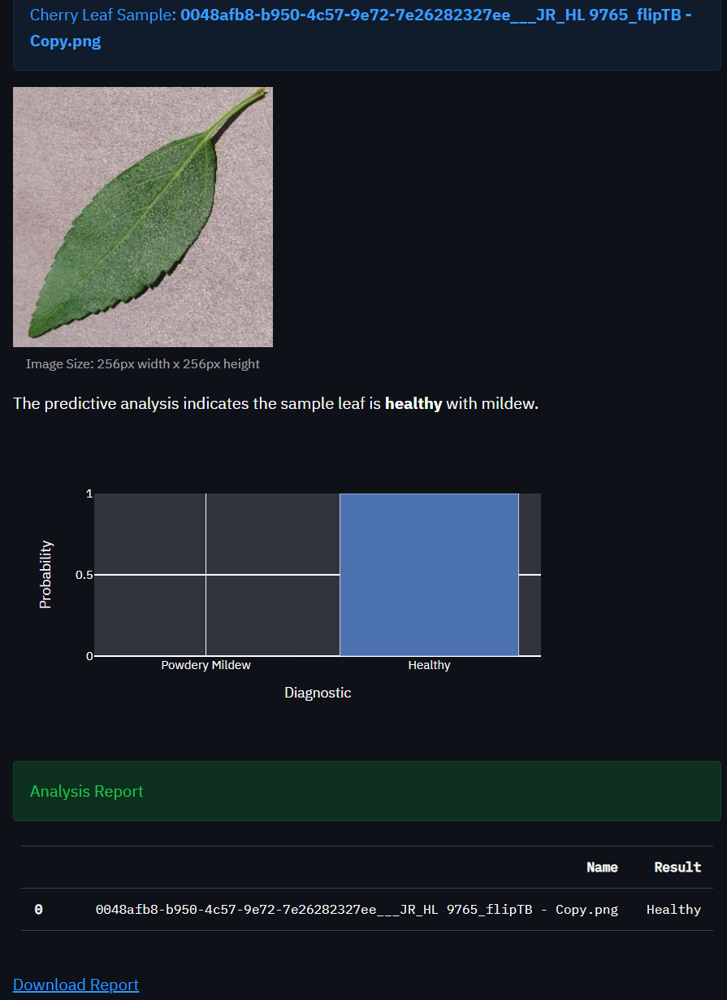
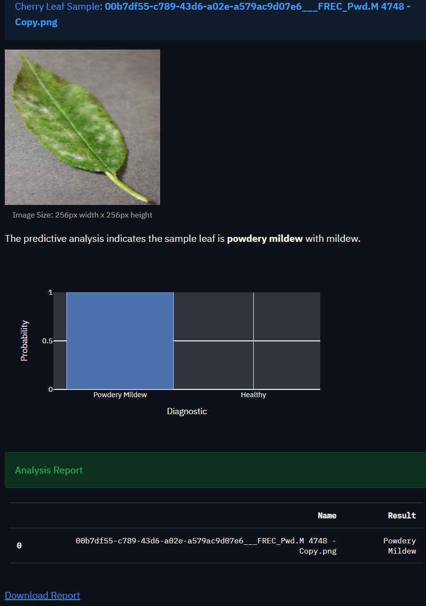
- A page detailing the project hypothesis and how it was validated throughout the project.
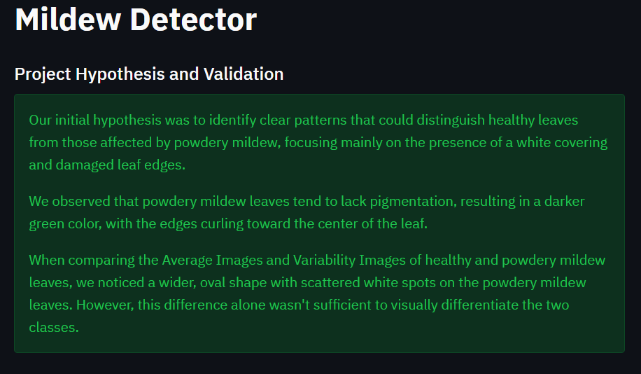
- A technical page showcasing model performance metrics.
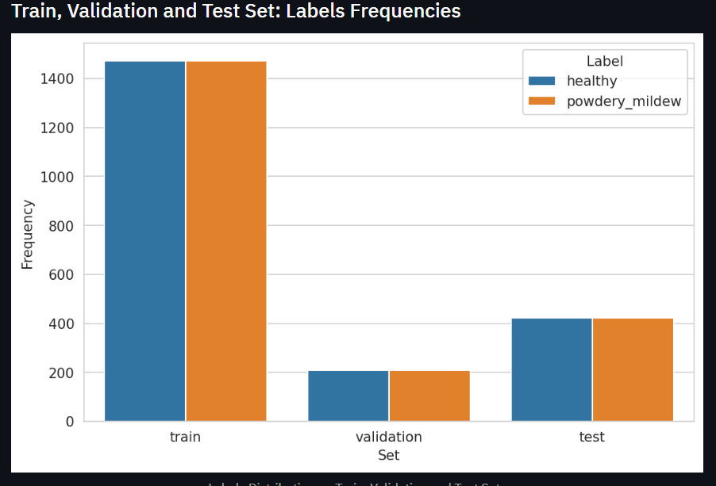
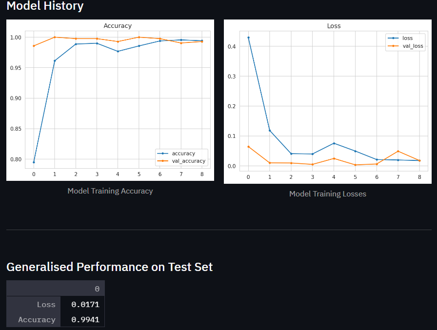

## Unfixed Bugs  
No current bugs as of now; however, there is an upcoming problem due to the Heroku-20 stack becoming deprecated. This will slowly cause bugs as time goes on and eventually no longer work.

Also, the Python version used (only compatible one with this project) is no longer supported, meaning it could also cause bugs in the future.

## Deployment  

### Heroku  
- Live App Link: [https://powdery-mildew-detection-mkm.herokuapp.com/](https:/powdery-mildew-detection-mkm.herokuapp.com/)  
- Set the `runtime.txt` Python version to a currently supported Heroku-20 stack.  
- The project was deployed to Heroku using the following steps:  
  1. Log in to Heroku and create an app.  
  2. At the Deploy tab, select GitHub as the deployment method.  
  3. Select your repository name and click Search. Once found, click Connect.  
  4. Choose the branch to deploy, then click Deploy Branch.  
  5. The deployment process should proceed smoothly if all necessary files are functional. Click the "Open App" button at the top of the page to access your application.  
  6. If the slug size is too large, add large files not needed for the app to the `.slugignore` file.

## Main Data Analysis and Machine Learning Libraries  
- **numpy**: Used to convert images into arrays for analysis and ML training, calculating means and standard deviations.  
- **pandas**: Facilitates dataset manipulation, including saving prediction reports as dataframes.  
- **matplotlib**: Utilized for plotting images, including augmented and data images.  
- **seaborn**: Used to visualize image datasets, especially when plotting multiple axes and features.  
- **tensorflow**: The main ML framework for building, training, and validating the model.  
- **streamlit**: Used to build the interactive dashboard.  
- **keras**: Employed for image augmentation and ML model training.

## Credits  
- The code for data modeling, visualization, and ML model creation, training, and deployment was adapted from Code Institute lessons and walkthrough projects.  
- The dashboard and `README.md` file were constructed using provided templates.
